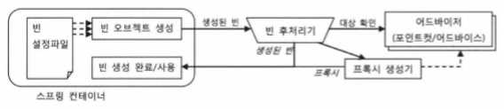

# 6장 AOP
🍀

## 6.5 스프링 AOP
### 목표
🚩 분리해 낸 코드를 *투명한 부가기능* 형태로 제공하자.
> 다른 코드에서는 그 존재가 보이지 않지만, 메소드가 호출되는 과정에 다이내믹하게 참여해서 부가적인 기능을 제공

<br>

### 6.5.1 자동 프록시 생성
> 😔 프록시 팩토리 빈 방식의 접근 방법의 한계

**1. 부가기능이 타깃 오브젝트마다 새로 만들어지는 문제**
- ProxyFactoryBean 어드바이스를 통해 해결

**2. 부가기능의 적용이 필요한 타겟 오브젝트마다 비슷한 내용의 ProxyFactoryBean 빈 설정 정보를 추가해주는 문제**

<br>

#### 중복 문제의 접근 방법
1. 전략 패턴과 DI 적용
   - 다이나믹 프록시 생성 팩토리에 DI로 제공
   - **변하는 부가기능 코드**

2. 다이나믹 프록시
   - 코드 자동 생성 기법 사용
   - **변하지 않는 타겟으로의 위임과 부가기능 적용 여부 판단하는 부분**

❓ *반복적인 ProxyFactoryBean 설정 문제를 해결하는 방법은 없을까?*

<br>

#### 빈 후처리기를 이용한 자동 프록시 생성기
> 스프링은 컨테이너로서 제공하는 기능 중에서 변하지 않는 핵심적인 부분 외에는 대부분 확장할 수 있도록 **확장 포인트를 제공** 해 준다.

➡️ 스프링 빈 오브젝트로 만들어지고 난 후, 다시 빈 오브젝트를 가공할 수 있게 해주는 **빈 후처리기** 를 사용해보자.

❔ 빈 후처리기 적용 방법

❕ 빈 후처리기 자체를 빈으로 등록한다. 스프링은 빈 후처리기가 빈으로 등록되어 있으면 빈 오브젝트가 생성될 때마다 빈 후처리기에 보내서 후처리 작업을 요청한다. 후처리 작업을 통해 스프링이 설정을 참고해서 만든 오브젝트가 아닌 다른 오브젝트를 빈으로 등록시키는 것이 가능하다.  
이를 이용하면 스프링이 생성하는 빈 오브젝트의 일부를 프록시로 포장하고, 프록시를 빈으로 대신 등록할 수 있다. (**자동 프록시 생성 빈 후처리기**)

##### DefaultAdvisorAutoProxyCreator
- 빈 후처리기 중 하나
- 어드바이저를 이용한 자동 프록시 생성기


1. DefaultAdvisorAutoProxyCreator 빈 후처리기가 등록되어 있으면 스프링은 빈 오브젝트를 만들 때마다 후처리기에 빈을 보낸다.
2. DefaultAdvisorAutoProxyCreator는 빈으로 등록된 모든 **어드바이저 내의 *포인트컷*** 을 이용해 전달받은 빈이 **프록시 적용 대상인지 확인** 한다.
3. 프록시 적용 대상이면 내장된 프록시 생성기에게 현재 빈에 대한 프록시를 만들게 하고, **만들어진 프록시에 어드바이저를 연결** 해준다.
4. 빈 후처리기는 프록시가 생성되면 원래 컨테이너가 전달해준 빈 오브젝트 대신 **프록시 오브젝트를 컨테이너에게 돌려준다**.
5. 컨테이너는 최종적으로 빈 후처리기가 돌려준 오브젝트를 빈으로 등록하고 사용한다.

<br>

#### 확장된 포인트컷
❗️ 포인트컷은 **타겟 오브젝트의 메소드 중에서 어떤 메소드에 부가기능을 적용할지 선정** 해주거나 **등록된 빈 중에서 어떤 빈에 프록시를 적용할 지 선택** 해주는 기능을 모두 갖고 있다.

```java
public interface Pointcut {
  ClassFilter getClassFilter(); // 프록시를 적용할 클래스인지 확인해준다.
  MethodMatcher getMethodMatcher(); // 어드바이스를 적용할 메소드인지 확인해준다.
}
```

만약 Pointcut 선정 기능을 모두 적용한다면 먼저 1️⃣ 프록시를 적용할 클래스인지 판단한 후, 적용 대상 클래스인 경우에는 2️⃣ 어드바이스를 적용할 메소드인지 확인하는 식으로 동작한다.

➡️ 모든 빈에 대해 프록시 자동 적용 대상을 선별해야 하는 빈 후처리기인 DefaultAdvisorAutoProxyCreator는 클래스와 메소드 선정 알고리즘을 모두 갖고 있는 포인트컷과 어드바이스가 결합되어 있는 어드바이저가 등록되어 있어야 한다.


<br>

#### 포인트컷 테스트
기존 구현한 예제 코드에서 클래스를 고를 수 있도록 고치고, 프록시 적용 후보 클래스를 여러 개 만들어둔 후 포인트컷을 적용한 ProxyFactoryBean으로 프록시를 만들도록 해서 어드바이스가 적용되는지 확인해보자.

480 페이지의 에제 코드를 보면, classNamePointcutAdvisor에서 클래스 이름이 HelloT로 시작하는 클래스만 선정하도록 수정하였고, 여러 케이스에 대해 적용 대상인지 확인한 후 메소드 선정 방식을 통해 어드바이스를 적용시키는 것을 확인할 수 있다.

⚠️ 포인트컷이 클래스 필터까지 동작해서 클래스를 걸러버리면 아무리 프록시를 적용했다고 해도 부가기능은 전혀 제공되지 않는다는 점에 주의하자.

<br>
<br>

### 6.5.2 DefaultAdvisorAutoProxyCreator의 적용
#### 클래스 필터를 적용한 포인트컷 작성
메소드 이름만 비교하던 포인트컷인 NameMatchMethodPointcut을 상속해서 프로퍼티로 주어진 이름 패턴을 가지고 클래스 이름을 비교하는 ClassFilter를 추가시킨다. (482p 6-51)

<br>

#### 어드바이저를 이용하는 자동 프록시 생성기 등록
어드바이저를 이용하는 자동 프록시 생성기를 등록하기 위해 DefaultAdvisorAutoProxyCreator 빈을 등록한다.

<br>

#### 포인트컷 등록
클래스 필터 지원 포인트컷을 빈으로 등록한다.

<br>

#### 어드바이스와 어드바이저
어드바이스 빈의 설정은 수정할 게 없지만, 어드바이저로서 사용되는 방법이 바뀌었다. 이제는 **명시적으로 DI하지 않는** 대신, *어드바이저를 이용하는 자동 프록시 생성기에 의해 자동수집되고, 프록시 대상 선정 과정에 참여하며, 자동생성된 프록시에 다이나믹하게 DI되어 동작* 하는 어드바이저가 된다.

<br>

#### ProxyFactoryBean 제거와 서비스 빈의 원상복구
더 이상 명시적인 프록시 팩토리 빈을 등록하지 않기 때문에 프록시를 적용하기 전의 단순한 상태로 돌려놓는다.

<br>

#### 자동 프록시 생성기를 사용하는 테스트
기존 테스트 코드는 ProxyFactoryBean이 빈으로 등록되어 있었으므로 이를 가져와 타겟을 테스트용 클래스로 바꿔치기하는 방법을 사용했지만, 자동 프록시 생성기를 적용한 후에는 가져올 팩토리 빈이 없기 때문에 다른 방법을 사용해야 한다.

❓ 그렇다면 어떻게 테스트 해야 할까?

❗️ 자동 프록시 생성기라는 스프링 컨테이너에 종속적인 기법을 사용했기 때문에 예외상황을 위한 테스트 대상도 빈으로 등록해줘야 한다.

예제 코드를 기준으로 테스트 클래스를 직접 빈으로 등록했을 때 문제점이 발생하는 부분이 있고, 485~486 페이지는 발생한 문제점들을 해결하는 과정이다.

> 📘 XML에서 빈을 등록할 때, 스태틱 멤버 클래스를 지정하고 싶다면 '$'를 사용하면 되고, parent 애트리뷰트를 이용하면 다른 빈 설정의 내용을 상속받을 수 있다.

테스트 코드 작성이 완료되었다면 테스트를 실행해본다.

**자동 프록시 생성기가 평범한 비즈니스 로직만 담고 있는 빈을 자동으로 트랜잭션 부가기능을 제공해주는 프록시로 대체했는지** 확인해보자.

<br>

#### 자동생성 프록시 확인
> 지금까지 트랜잭션 어드바이스를 적용한 프록시 자동생성기를 빈 후처리기 메커니즘을 통해 적용하였다. 확인해야 할 사항은 다음과 같다.

1. 트랜잭션이 필요한 빈에 트랜잭션 부가기능이 적용되었는가?
   - 예외 상황에서 트랜잭션이 롤백되게 함으로써 트랜잭션 적용 여부를 테스트한다.

2. 프록시 자동생성기가 어드바이저 빈에 연결해둔 포인트컷의 클래스 필터를 이용해서 정확히 원하는 빈에만 프록시를 생성하였는가?
   - 전부 확인하기는 어려우므로 클래스 필터가 제대로 동작하는지 확인한다.

<br>
<br>

### 6.5.3 포인트컷 표현식을 이용한 포인트컷
**메소드 이름과 클래스의 이름 패턴을 각각 클래스 필터와 메소드 매처 오브젝트로 비교해서 선정하는 방식**

😔 일일이 클래스 필터와 메소드 매처를 구현하거나, 스프링이 제공하는 필터나 매처 클래스를 가져와 프로퍼티를 설정해야 한다.  
😔 단순히 이름을 비교하는 기능밖에 하지 못한다.

> ❔ 더 복잡하고 세밀한 기준을 이용해 클래스나 메소드를 선정하게 하려면?

**1. 리플렉션 API**  
클래스와 메소드의 이름, 정의된 패키지 등 여러 정보를 알아낼 수 있지만, 작성하기가 번거롭다.

**2. 포인트컷 표현식(pointcut expression)**
- AspectJExpressionPointcut 클래스 사용하여 적용

<br>

#### AspectJExpressionPointcut
- 클래스와 메소드의 선정 알고리즘을 포인트컷 표현식을 이용해 한 번에 지정할 수 있게 해준다.
- 포인트컷 표현식은 자바의 RegEx클래스가 지원하는 정규식처럼 강력한 표현식을 지원한다.
- AspectJ 프레임워크에서 제공하는 것을 가져와 확장해서 사용하므로, **AspectJ 포인트컷 표현식** 이라고도 한다.

<br>

#### 포인트컷 표현식 문법
AspectJ 포인트컷 표현식은 포인트컷 지시자를 이용해 작성한다. 지시자 중 execution()이 가장 대표적으로 사용된다.

`execution(1️⃣[접근제한자 패턴] 2️⃣타입패턴 3️⃣[타입패턴.]4️⃣이름패턴 5️⃣(타입패턴 | *..*, ...)) 6️⃣[throws 예외 패턴]`

1️⃣ public, private과 같은 접근제한자. 생략 가능  
2️⃣ 리턴 값의 타입 패턴. 필수항목으로, 반드시 하나의 타입을 지정해야 한다.  
3️⃣ 패키지와 클래스 이름에 대한 패턴. 생략 가능하며, 사용할 때는 '.'을 두어서 연결해야 한다.  
4️⃣ 메소드 이름 패턴. 필수항목이다.  
5️⃣ 파라미터의 타입 패턴을 순서대로 넣을 수 있다. 와일드카드를 이용해 파라미터 개수에 상관 없는 패턴을 만들 수 있다. 필수 항목이다.  
6️⃣ 예외 이름 패턴. 생략 가능

(생략 가능한 항목을 생략했을 경우, 모든 경우를 다 허용하여 느슨한 포인트컷이 된다는 점에 주의하자)

메소드 시그니처를 이용한 포인트컷 표현식 테스트는 492페이지의 코드 예제에 잘 나타나 있다. pointcut에 표현식을 지정하고, 그 표현식으로 메소드 매처와 클래스 필터에서 잘 동작하는 것을 확인할 수 있다.

포인트컷 표현식 | 설명
--- | ---
* | 리턴 값의 타입에 대한 제한을 없애고 어떤 리턴 타입을 가졌던 상관없이 선정하도록 만든다.
(..) | 파라미터의 개수와 타입을 무시한다.


<br>

#### 포인트컷 표현식을 이용하는 포인트컷 적용
AspectJ 포인트컷 표현식은 메소드의 시그니처를 비교하는 방식인 execution() 외에도 몇 가지 표현식 스타일을 갖고 있다.
- 빈의 이름으로 비교하는 bean()
- 특정 애노테이션이 타입, 메소드, 파라미터에 적용되어 있는 것을 보고 메소드를 선정하게 하는 포인트컷

이전에 ProxyFactoryBean을 적용했던 코드에 AspectJExpressionPointcut 빈을 등록하고, 표현식을 적용시키는 내용이 498~499 페이지에 나와있다.

<br>

#### 타입 패턴과 클래스 이름 패턴
타입 패턴 | 클래스 패턴
--- | ---
포인트컷 표현식에서 사용 |
**슈퍼클래스, 인터페이스 등을 따져 타입 패턴의 조건에 충족하는 빈은 모두 선정한다.** | 단순하게 이름이 매치되면 선정한다.

포인트컷 표현식에서 타입 패턴이라고 명시된 부분은 모두 동일한 원리가 적용된다.

<br>
<br>

### 6.5.4 AOP란 무엇인가?
예제 코드를 작성해 온 과정을 되짚어본다.
#### 트랜잭션 서비스 추상화
트랜잭션 경계설정 코드를 비즈니스 로직을 담은 코드에 넣으려니 특정 트랜잭션 기술에 종속되는 코드가 되어버리는 문제가 발생하였다.

❗️ 트랜잭션 적용이라는 추상적인 작업 내용은 유지한 채로 구체적인 구현 방법을 자유롭게 바꿀 수 있도록 서비스 추상화 기법 적용하였다. 인터페이스와 DI를 통해 무엇을 하는지는 남기고, 그것을 어떻게 하는지를 분리하여 어떻게 할지는 더 이상 비즈니스 로직 코드에는 영향을 주지 않고 독립적으로 변경할 수 있게 되었다.

<br>

#### 프록시와 데코레이터 패턴
여전히 비즈니스 로직 코드에는 트랜잭션을 적용하고 있다는 사실이 드러나 있으나, 트랜잭션의 경계설정을 담당하는 코드의 특성 때문에 단순한 추상화와 메소드 추출 방법으로는 더 이상 제거할 방법이 없었다.

❗️ DI를 이용해 데코레이터 패턴을 적용한다. 이로 인해 비즈니스 로직 코드는 트랜잭션같은 성격이 다른 코드로부터 자유로워지고, 독립적으로 로직을 검증하는 고립된 단위 테스트를 만들 수 있게 되었다.

<br>

#### 다이내믹 프록시와 프록시 팩토리 빈
프록시를 이용해서 비즈니스 로직 코드에서 트랜잭션 코드를 모두 제거할 수 있었지만, 비즈니스 로직 인터페이스의 모든 메소드마다 트랜잭션 기능을 부여하는 코드를 넣어 프록시 클래스를 만드는 작업이 번거로워졌다.

❗️ 프록시 클래스 없이도 프록시 오브젝트를 런타임 시에 만들어주는 JDK 다이나믹 프록시 기술을 적용하였지만, 동일한 기능의 프록시를 여러 오브젝트에 적용할 경우 오브젝트 단위로는 중복이 일어나는 문제는 해결하지 못했다.

❗️ 프록시 기술을 추상화한 스프링의 프록시 팩토리 빈을 이용해서 다이나믹 프록시 생성 방법에 DI를 도입했다. 포인트컷은 프록시에서 분리될 수 있었고, 여러 프록시에서 공유해서 사용할 수 있게 되었다.

<br>

#### 자동 프록시 생성 방법과 포인트컷
트랜잭션 적용 대상이 되는 빈마다 일일이 프록시 팩토리 빈을 설정해줘야 한다는 부담이 남아 있었다.

❗️ 스프링 컨테이너의 빈 생성 후처리 기법(+ 확장된 포인트컷)을 활용해 컨테이너 초기화 시점에서 자동으로 프록시를 만들어주는 방법을 도입하였다. 이 방법으로 인해 트랜잭션 부가기능을 어디에 적용하는지에 대한 정보를 포인트컷이라는 독립적인 정보로 완전히 분리할 수 있었다.

<br>

#### 부가기능의 모듈화
트랜잭션 경계설정 기능은 다른 모듈의 코드에 부가적으로 부여되는 기능이므로 기존에 써왔던 방법으로는 간단하게 분리해서 독립된 모듈로 만들 수 없었다.

❗️ 트랜잭션 경계설정 기능을 독립적으로 모듈화시키고, 포인트컷으로 부가기능을 부여할 대상을 선정하는 방법을 적용하였다. 이 기법으로 인해 핵심기능을 담은 코드와 설정에는 전혀 영향을 주지 않아도 된다.

<br>

#### ⭐️AOP: 애스펙트 지향 프로그래밍
부가기능 모듈화 작업은 기존의 객체지향 설계 패러다임과는 구분되는 새로운 특성이 있다. ➡️ 애스펙트(Aspect)

> **애스펙트** 란 그 자체로 애플리케이션의 핵심기능을 담고 있지는 않지만, 애플리케이션을 구성하는 중요한 한 가지 요소이고, 핵심기능에 부가되어 의미를 갖는 특별한 모듈을 가리킨다.

**애스펙트 =** **어드바이스**(부가될 기능을 정의한 코드) **+ 포인트컷**(어드바이스를 어디에 적용할지 결정)


⭐️ **애스펙트 지향 프로그래밍(AOP: Aspect Oriented Programming)**

> 애플리케이션의 핵심적인 기능에서 부가적인 기능을 분리해서 애스펙트라는 독특한 모듈로 만들어서 설계하고 개발하는 방법  
> **OOP를 돕는 보조적인 기술로, OOP를 완전히 대체하는 새로운 개념은 아니다.**

> 애플리케이션을 특정한 관점을 기준으로 바라볼 수 있게 해준다는 의미에서 **관점 지향 프로그래밍** 이라고도 한다.

<br>
<br>

### 6.5.5 AOP 적용기술
#### 프록시를 이용한 AOP
스프링은 IoC/DI 컨테이너와 다이나믹 프록시, 데코레이터 패턴, **프록시 패턴**, 자동 프록시 생성 기법, 빈 오브젝트의 후처리 조작 기법등의 다양한 기술을 조합해 AOP를 지원하고 있다.

프록시를 사용하여 DI로 연결된 빈 사이에 적용해 타겟의 메소드 호출 과정에 참여해서 부가기능을 제공해주도록 만들었기 때문에, *스프링 AOP는 자바의 기본 JDK와 스프링 컨테이너 외에는 특별한 기술이나 환경을 요구하지 않는다.*

독립적으로 개발한 부가기능 모듈을 다양한 타겟 오브젝트의 메소드에 다이나믹하게 적용해주기 위해 가장 중요한 역할을 맡고 있는 것이 프록시로, 스프링 AOP는 프록시 방식의 AOP라고 할 수 있다.

<br>

#### 바이트코드 생성과 조작을 통한 AOP
❔ 프록시 방식이 아닌 AOP도 있다는 뜻인가?

❕ AOP 기술의 원조이자, 가장 강력한 프레임워크로 꼽히는 AspectJ는 프록시를 사용하지 않는 대표적인 AOP 기술이다.

❓ 프록시를 사용하지 않고 어떻게 독립적으로 만든 부가기능을 다이나믹하게 다양한 타겟 오브젝트에 적용해줄 수 있는가?

❗ AspectJ는 프록시처럼 간접적인 방법이 아니라 타겟 오브텍트를 뜯어고쳐서 부가기능을 직접 넣어주는 직접적인 방법을 사용한다.

❔ 왜 굳이 그런 복잡한(컴파일된 클래스 파일 수정이나 바이트코드 조작과 같은) 방법을 사용하는가?

❕ 1️⃣ 타겟 오브젝트를 직접 수정해버리면 스프링과 같은 DI 컨테이너의 도움을 받지 않아도 AOP를 적용할 수 있기 때문이다.  
2️⃣ 프록시 방식보다 훨씬 강력하고 유연한 AOP가 가능하기 때문이다. 프록시 방식을 사용할 때는 불가능한 영역까지 AOP를 적용시킬 수 있다.

> 일반적인 AOP를 적용하는 데는 프록시 방식의 스프링 AOP로도 충분하고, 간혹 특별한 AOP 요구사항이 생겨 스프링의 프록시 AOP 수준을 넘어서는 기능이 필요하다면 그 때 AspectJ를 이용할 수도 있다.

<br>
<br>

### 6.5.6 AOP의 용어
용어 | 설명
--- | ---
**타겟** | 부가기능을 부여할 대상<br>핵심기능을 담은 클래스일 수도 있지만 경우에 따라서는 다른 부가기능을 제공하는 프록시 오브젝트일 수도 있다.
**어드바이스** | 타겟에게 제공할 부가기능을 담은 모듈<br>어드바이스는 오브젝트로 정의하기도 하지만 메소드 레벨에서 정의할 수도 있다.
**조인 포인트** | 어드바이스가 적용될 수 있는 위치<br>스프링의 프록시 AOP에서 조인 포인트는 메소드의 실행 단계뿐이다.<br>타겟 오브젝트가 구현한 인터페이스의 모든 메소드는 조인 포인트가 된다.
**포인트컷** | 어드바이스를 적용할 조인 포인트를 선별하는 작업 또는 그 기능을 정의한 모듈<br>스프링의 포인트컷은 메소드를 선정하는 기능을 갖고 있다.
**프록시** | 클라이언트와 타겟 사이에 투명하게 존재하면서 부가기능을 제공하는 오브젝트<br>DI를 통해 타겟 대신 클라이언트에게 주입되며, 클라이언트의 메소드 호출을 대신 받아서 타겟에 위임해주면서, 그 과정에서 부가기능을 부여한다.<br>스프링은 프록시를 이용해 AOP를 지원한다.
**어드바이저** | 포인트컷과 어드바이스를 하나씩 갖고 있는 오브젝트<br>어떤 부가기능(어드바이스)을 어디에(포인트컷) 전달할 것인가를 알고 있는 AOP의 가장 기본이 되는 모듈<br>스프링에서는 자동 프록시 생성기가 어드바이저를 AOP 작업의 정보로 활용한다.<br>*스프링 AOP에서만 사용되는 용어이다.*
**애스펙트** | AOP의 기본 모듈(OOP의 클래스)<br>한 개 또는 그 이상의 포인트컷과 어드바이스의 조합으로 만들어지며 보통 싱글톤 형태의 오브젝트로 존재<br>👉 클래스와 같은 모듈 정의와 오브젝트와 같은 실체(인스턴스)의 구분이 특별히 없다.<br>스프링의 어드바이저는 아주 단순한 애스펙트라고 볼 수도 있다.

<br>

### 6.5.7 AOP 네임스페이스
> 스프링의 프록시 방식 AOP를 적용하기 위해서는 최소한 네 가지 빈을 등록해야 한다.

#### 자동 프록시 생성기
스프링의 DefaultAdvisorAutoProxyCreator 클래스를 빈으로 등록한다. 다른 빈을 DI하지도, 자신이 DI되지도 않으며 독립적으로 존재하므로, id도 굳이 필요하지 않다.  빈 후처리기로서 참여하여 빈으로 등록된 어드바이저를 이용해서 프록시를 자동으로 생성하는 기능을 담당한다.

#### 어드바이스
부가기능을 구현한 클래스를 빈으로 등록한다.

#### 포인트컷
스프링의 AspectJExpressionPointcut 클래스를 빈으로 등록해서 사용한다. expression 프로퍼티에 포인트컷 표현식을 넣어주면 된다.

#### 어드바이저
DefaultPointcutAdvisor 클래스를 빈으로 등록해서 사용한다. 어드바이스와 포인트컷을 프로퍼티로 참조하는 것 외에는 기능이 없으며, 자동 프록시 생성기에 의해 자동 검색되어 사용된다.

<br>

#### AOP 네임스페이스
> 스프링에서는 AOP와 관련된 태그를 정의해둔 **aop 스키마** 를 제공하여 AOP를 위해 기계적으로 적용하는 빈들을 간편한 방법으로 등록할 수 있다.

aop 스키마에 정의된 태그는 별도의 네임스페이스를 지정해서 디폴트 네임스페이스의 &lt;bean&gt; 태그와 구분해서 사용할 수 있다.

```xml
<?xml version=1.0 encoding="UTF-8"?>
<beans xmlns="http://www.springframework.org/schema/beans"
  xmlns:xsi="http://www.w3.org/2001/XMLSchema-instance"
  xmlns:aop="http://www.springframework.org/schema/aop"
  xsi:schemaLocation="http://www.springframework.org/schema/beans
                      http://www.springframework.org/schema/beans/spring-beans.xsd
                      http://www.springframework.org/schema/aop
                      http://www.springframework.org/schema/aop/spring-aop-3.0.xsd">
</beans>
```

beans 스키마는 디폴트 네임스페이스이므로 접두어 없이 사용할 수 있으며, aop 스키마는 aop 네임스페이스를 가지므로 aop 접두어를 사용하는 것에 유의하며 읽어보자.

511 페이지를 보면 &lt;aop:config&gt;, &lt;aop:pointcut&gt;, &lt;aop:advisor&gt; 세 가지 태그를 정의해두면 그에 따라 세 개의 빈이 자동으로 등록된다. 이러한 특별한 빈들은 별도의 스키마에 정의된 전용 태그를 사용해 정의해주면 편리하다.

애플리케이션을 구성하는 컴포넌트 빈과 컨테이너에 의해 사용되는 기반 기능을 지원하는 빈은 구분이 되는 것이 좋다.

&lt;bean&gt; 태그를 사용할 때보다 이해하기도 쉽고 코드의 양도 대폭 줄은 것을 확인할 수 있다

<br>

#### 어드바이저 내장 포인트컷
> AspectJ 포인트컷 표현식을 활용하는 포인트컷은 스트링으로 된 표현식을 담은 expression 프로퍼티 하나만 설정해주면 사용할 수 있다. 또한, 포인트컷은 어드바이저에 참조되어야만 사용된다.

aop 스키마의 전용 태그를 사용하는 경우, 굳이 포인트컷을 독립적인 태그로 두지 않고 어드바이저 태그에서 참조하는 대신 어드바이저 태그와 결합하는 방법이 가능하다.

<br>
<br>
<br>

## 6.6 트랜잭션 속성
> 트랜잭션을 가져올 때 파라미터로 트랜잭션 매니저에게 전달하는 DefaultTransactionDefinition의 용도가 무엇인지 알아보자.

<br>

### 6.6.1 트랜잭션 정의
> 트랜잭션 경계 안에서 진행된 작업은 commit()을 통해 전부 성공하든지, 아니면 rollback()을 통해 모두 취소되어야 한다. 그러나 이 밖에도 **트랜잭션의 동작방식을 제어할 수 있는 몇 가지 조건이 있다.**

#### 트랜잭션 전파(transaction propagation)
트랜잭션의 경계에서 이미 진행 중인 트랜잭션이 있을 때(또는 없을 때) 어떻게 동작할 것인가를 결정하는 방식이다.

다표적으로 다음과 같은 트랜잭션 전파 속성을 줄 수 있다.

- PROPAGATION_REQUIRED
   - 진행 중인 트랜잭션이 없으면 새로 시작하고, 이미 시작된 트랜잭션이 있다면 이에 참여한다.
- PROPAGATION_REQUIRED_NEW
   - 항상 새로운 트랜잭션을 시작한다. 앞에서 시작된 트랜잭션의 존재여부에 상관없이 새로운 트랜잭션을 만들어서 독자적으로 동작하게 하므로, 독립적인 트랜잭션이 보장되어야 하는 코드에 적용할 수 있다.
- PROPAGATION_NOT_SUPPORTED
   - 트랜잭션 없이 동작하도록 만들 수 있다. 진행 중인 트랜잭션이 있어도 무시한다.
   - ❓ 그렇다면 왜 사용하는가? ❗ 트랜잭션 경계설정은 보통 AOP를 이용해 한 번에 많은 메소드에 동시에 적용하는 방법을 사용하는데, 그 중 특별한 메소드만 트랜잭션 적용에서 제외하고자 할 때 사용한다.

<br>

#### 격리수준(isolation level)
서버환경에서는 여러 개의 트랜잭션이 동시에 진행될 수 있는데, 너무 순차적으로 진행할 경우 성능이 크게 떨어지게 되므로, 적절하게 격리수준을 조정해서 가능한 한 많은 트랜잭션을 동시에 진행시키면서도 문제가 발생하지 않게 하는 제어가 필요하다.

<br>

#### 제한시간(timeout)
트랜잭션을 수행하는 제한시간을 설정한다.

<br>

#### 읽기전용(read only)
읽기전용으로 설정해두면 트랜잭션 내에서 데이터를 조작하는 시도를 막아줄 수 있고, 데이터 액세스 기술에 따라서 성능이 향상될 수도 있다.

❓ 트랜잭션 정의를 수정하려면 어떻게 해야 할까?

❗ 디폴트 속성을 갖고 있는 오브젝트를 사용하는 대신 외부에서 정의된 오브젝트를 DI 받아서 사용하도록 만든다. 하지만 이 방법으로 트랜잭션의 속성을 변경하면 해당 어드바이스를 사용하는 모든 트랜잭션의 속성이 *한꺼번에 바뀐다* 는 문제가 있다.

❔ ***원하는 메소드만 선택해서 독자적인 트랜잭션 정의를 적용할 수 있는 방법은 없을까?***

<br>
<br>

### 6.6.2 트랜잭션 인터셉터와 트랜잭션 속성
> ❕ 메소드별로 다른 트랜잭션 정의를 적용하려면 **어드바이스의 기능을 확장** 해야 한다. 메소드 이름 패턴에 따라 다른 트랜잭션 정의가 적용되도록 만드는 것이다.

#### TransactionInterceptor
스프링에는 편리하게 트랜잭션 경계설정 어드바이스로 사용할 수 있도록 만들어진 **TransactionInterceptor** 가 존재한다.

TransactionInterceptor 어드바이스는 트랜잭션 정의를 *메소드 이름 패턴* 을 이용해서 다르게 지정할 수 있는 방법을 추가로 제공해준다.

TransactionInterceptor에는 기본적으로 두 가지 종류의 예외처리 방식이 있다.

1️⃣ 런타임 예외 발생 시 트랜잭션은 롤백된다.

2️⃣ 타겟 메소드가 런타임 예외가 아닌 체크 예외를 던지는 경우, 이것을 예외 상황으로 해석하지 않고 일종의 비즈니스 로직에 따른, **의미가 있는 리턴 방식의 한 가지로 인식해서 트랜잭션을 커밋해버린다.**

이는 스프링의 기본적인 예외처리 원칙에 따르는 것인데, 원칙에 따르지 않아야 할 경우가 있을 수 있다. 이 경우를 대비하여 TransactionAttribute는 rollbackOn()이라는 속성을 둬서 *기본 원칙과 다른 예외처리가 가능하게 해준다.*

<br>

#### 메소드 이름 패턴을 이용한 트랜잭션 속성 지정
Properties 타입의 transactionAttributes 프로퍼티는 메소드 패턴과 트랜잭션 속성을 키와 값으로 갖는 컬렉션이다.

`1️⃣PROPAGATION_NAME, 2️⃣ISOLATION_NAME, 3️⃣readOnly, 4️⃣timeout_NNNN, 5️⃣-Exception1, 6️⃣+Exception2`

1️⃣ 트랜잭션 전파 방식. *필수항목* 이다.  
2️⃣ 격리 수준  
3️⃣ 읽기전용 항목(트랜잭션이 처음 시작될 때가 아니라면 적용되지 않는다.)  
4️⃣ 제한시간. 초 단위 시간을 뒤에 붙인다.(트랜잭션이 처음 시작될 때가 아니라면 적용되지 않는다.)  
5️⃣ 체크 예외 중에서 롤백 대상으로 추가할 것을 넣는다. 한 개 이상 등록할 수 있다.  
6️⃣ 런타임 예외지만 롤백시키지 않을 예외들을 넣는다. 한 개 이상 등록할 수 있다.

❓ 속성을 하나의 문자열로 표현하게 만든 이유

❗ 트랜잭션 속성을 메소드 패턴에 따라 여러 개를 지정해줘야 하는데, 일일이 중첩된 태그와 프로퍼티로 설정하게 만들면 번거롭다. 또한 대부분은 디폴트를 사용해도 충분하다.

메소드 이름이 하나 이상의 패턴과 일치하는 경우, 메소드 이름의 패턴 중에서 가장 정확히 일치하는 것이 적용된다.

<br>

#### tx 네임스페이스를 이용한 설정 방법
TransactionInterceptor 타입의 어드바이스 빈과 TransactionAttribute 타입의 속성 정보도 tx 스키마의 전용 태그를 이용해 정의할 수 있다.

520~521 페이지의 예제를 보면, tx 스키마의 위치를 지정하고 TransactionInterceptor 빈을 등록하는 것을 확인할 수 있다.

&lt;bean&gt; 태그로 등록하는 경우에 비해 장점이 많기 때문에 tx 스키마의 태그를 사용해 어드바이스를 등록하도록 권장한다.

<br>
<br>

### 6.6.3 포인트컷과 트랜잭션 속성의 적용 전략
> 트랜잭션 부가기능을 적용할 후보 메소드를 선정하는 작업은 **포인트컷** 에 의해 진행되고, 어드바이스의 **트랜잭션 전파 속성** 에 따라서 메소드별로 트랜잭션의 적용 방식이 결정된다.

😄 포인트컷 표현식과 트랜잭션 속성을 정의할 때 따르면 좋은 몇 가지 전략

#### 트랜잭션 포인트컷 표현식은 타입 패턴이나 빈 이름을 이용한다
- 트랜잭션용 포인트컷 표현식에는 메소드나 파라미터, 예외에 대한 패턴을 정의하지 않는 것이 바람직하다.  
- 또한, 가능하면 클래스보다는 변경 빈도가 적고 일정한 패턴을 유지하기 쉬운 인터페이스 타입을 기준으로 타입 패턴을 적용하는 것이 좋다.  
- 클래스나 인터페이스 이름에 일정한 규칙을 만들기 어려운 경우, 빈 이름을 기준으로 선장하는 bean() 표현식을 사용하는 방법을 고려해본다.

#### 공통된 메소드 이름 규칙을 통해 최소한의 트랜잭션 어드바이스와 속성을 정의한다
- 너무 다양하게 트랜잭션 속성을 부여하면 관리만 힘들어지므로, 기준이 되는 몇 가지 트랜잭션 속성을 정의하고 그에 따라 적절한 메소드 명명 규칙을 만들어 두는 것이 좋다.

#### 프록시 방식 AOP는 같은 타겟 오브젝트 내의 메소드를 호출할 때는 적용되지 않는다
- ⚠️ 프록시 방식의 AOP에서는 프록시를 통한 부가기능의 적용은 클라이언트(인터페이스를 통해 타겟 오브젝트를 사용하는 다른 모든 오브젝트)로부터의 호출이 일어날 때만 가능하다.  
- 반대로 타겟 오브젝트가 자기 자신의 메소드를 호출할 때는 프록시를 통한 부가기능의 적용이 일어나지 않는다.

❗ **해결방안**
1. 스프링 API를 이용해 프록시 오브젝트에 대한 레퍼런스를 가져온 뒤에 같은 오브젝트의 메소드 호출도 프록시를 이용하도록 강제한다.
> 스프링 API와 프록시 호출 코드가 등장하는 것이 별로 바람직하지 않으므로, 추천되지 않는다.

2. AspectJ와 같은 타겟의 바이트코드를 직접 조작하는 방식의 AOP 기술을 적용한다.
> 스프링은 프록시 기반의 AOP를 기본적으로 사용하고 있지만 필요하면 언제든지 AspectJ 방식으로 변경할 수 있다.

<br>
<br>

### 6.6.4 트랜잭션 속성 적용
트랜잭션 속성과 그에 따른 트랜잭션 전략을 UserService 예제에 적용하는 과정을 담고 있다. 교재를 보며 함께 흐름을 읽어보자.
