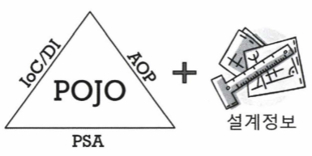
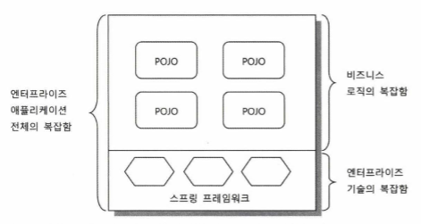

# 8장 스프링이란 무엇인가?
> 과연 스프링이란 무엇이고 어떻게 설명할 수 있을까? 스프링 프레임워크가 만들어진 이유와 존재 목적, 추구하는 가치는 무엇일까?

 

## 8.1 스프링의 정의
> **자바 엔터프라이즈 개발을 편하게** 해주는 **오픈소스** **경량급** **애플리케이션 프레임워크**

### 애플리케이션 프레임워크
일반적인 라이브러리나 프레임워크는 특정 업무 분야나 한 가지 기술에 특화된 목표를 가지고 만들어진다. 반면에 **애플리케이션 프레임워크는 특정 계층이나 기술, 업무 분야에 국한되지 않고 애플리케이션의 전 영역을 포괄하는 범용적인 프레임워크** 를 말한다.

단지 여러 계층의 다양한 기술을 한데 모아뒀기 때문에 애플리케이션 프레임워크라고 불리는 것이 아니다.

스프링은 애플리케이션의 전 영역을 관통하는 일관된 프로그래밍 모델과 핵심 기술을 바탕으로 하여 각 분야의 특성에 맞는 필요를 채워주고 있어 애플리케이션을 빠르고 효과적으로 개발할 수 있다. 이런 점으로 인해 스프링이 애플리케이션 프레임워크라고 불리는 것이다.

> ⭐ **핵심 기술에 담긴 프로그래밍 모델을 일관되게 적용해서 엔터프라이즈 애플리케이션 전 계층과 전 영역에 전략과 기능을 제공해줌으로써 애플리케이션을 편하게 개발하게 해주는 애플리케이션 프레임워크**

 

### 경량급(lightweight)
❓ 스프링이 매우 복잡하고 방대한 규모의 프레임워크임에도 가볍다고 하는 이유는?

❗ 불필요하게 무겁지 않다는 의미이다. '경량급'이란 EJB 같은 과도한 엔지니어링이 적용된 기술과 스프링을 대비시켜 설명하려고 사용된 표현이다.

비교 | EJB | Spring
--- | --- | ---
운용서버 | 고가의 느리고 무거운 WAS 필요 | 단순한 서버환경인 Tomcat이나 Jetty에서도 완벽하게 동작함
개발환경 | 툴의 도움이 필요하고, 고가로 구성된 개발환경을 갖춰야만 함 | 단순한 개발툴과 기본적인 개발환경으로도 충분함
코드 | 기술과 환경을 지원하기 위해 불필요한 코드를 많이 집어넣어야 했음 | EJB 코드에서 불필요하게 등장하던 부분을 제거하여 단순해짐

> 스프링은 EJB를 대표로 하는 기존의 많은 기술이 불필요하게 무겁고 복잡했음을 증명한 셈이고, 그런 면에서 스프링은  ⭐ **군더더기 없이 깔끔한 기술을 가진 '경량급' 프레임워크** 라고 불린 것이다.

 

### 자바 엔터프라이즈 개발을 편하게
기존 기술과 프레임워크과 스프링이 주장하는 이 대목의 무게는 다르다.

> 스프링은 **근본적인 부분에서** 엔터프라이즈 개발의 복잡함을 제거해내고 진정으로 개발을 편하게 해주는 해결책을 제시한다.

❓ 편리한 애플리케이션 개발이란?

❗ 개발자가 복잡하고 실수하기 쉬운 로우레벨 기술에 많은 신경을 쓰지 않으면서도 애플리케이션의 핵심인 사용자의 요구사항, 즉 비즈니스 로직을 빠르고 효과적으로 구현하는 것

EJB의 비전과 목표 역시 편리한 애플리케이션 개발이었지만, 이 과정에서 다른 차원의 더 큰 복잡함을 끌고들어오는 실수를 저질렀다. 이에 EJB의 잘못된 접근 방식에 대한 대안을 모색하게 되었고, 스프링도 그 과정에서 등장하였다.

스프링은 애플리케이션 개발자들이 스프링이라는 프레임워크가 제공하는 기술이 아니라 자신이 작성하는 애플리케이션의 로직 에 더 많은 관심과 시간을 쏟게 해준다.

> 스프링은 ⭐ **엔터프라이즈 개발에서 필연적으로 요구되는 기술적인 요구를 충족하면서도 개발을 복잡하게 만들지 않는다.**

 

### 오픈소스
스프링은 오픈소스 라이선스 중에서도 비교적 제약이 적고 사용이 매우 자유로운 편인 아파치 라이선스 버전 2.0(Apache License Ver 2.0)이다.

#### 장점
- 개발 과정에서 많은 사람이 자유롭게 참여한다.
- 온라인 커뮤니티가 존재하여 의견 제시나 패치 제공, 버그 신고, 공개적인 토론이 가능하다.
- 피드백이 빠르다.
- 라이선스 비용에 대한 부담이 없다.

#### 단점
- 지속적이고 안정적인 개발이 계속될지 불확실하다.
   - 이를 해결하기 위해 개발을 책임지고 진행할 수 있는 전문 기업을 만들었다.

> 스프링은 ⭐ **오픈소스의 장점을 충분히 취하는 동시에 오픈소스 제품의 단점과 한계를 잘 극복하고 있는 전문적이고 성공적인 오픈소스 소프트웨어라고 할 수 있다.**

 
 

## 8.2 스프링의 목적
> 스프링의 개발 철학과 궁극적인 목표는 무엇일까?

### 8.2.1 엔터프라이즈 개발의 복잡함
❓ 왜 자바 엔터프라이즈(JavaEE) 프로젝트는 실패하는가?

❗ 엔터프라이즈 시스템 개발이 너무 복잡해져서!

#### 복잡함의 근본적인 이유
1. **기술적인 제약조건과 요구사항이 늘어남**
   - 엔터프라이즈 시스템을 개발하는 데에는 순수한 비즈니스 로직 외에도 기술적으로 고려해야 할 사항이 많다.
2. **엔터프라이즈 애플리케이션이 구현해야 할 핵심기능인 비즈니스 로직의 복잡함이 증가함**
   - 엔터프라이즈 시스템에 대한 업무 의존도가 높아지면서, 다양하고 복잡한 업무 처리 기능을 엔터프라이즈 시스템이 구현해야만 한다.
   - 변화의 속도가 빨라지면서 애플리케이션을 자주 수정해줘야 한다.

#### 복잡함을 가중시키는 원인
> 엔터프라이즈 애플리케이션 개발이 실패하는 주요 원인은 **비즈니스 로직의 복잡함** 과 **기술적인 복잡함** 이다.

> 자바 엔터프라이즈 시스템 개발이 어려운 가장 큰 이유는 **근본적인 비스니스 로직와 엔터프라이즈 기술이라는 두 가지 복잡함이 한데 얽혀 있기 때문이다.**

로그 라이브러리와 JDBC API 사용 등, 비즈니스 로직과 기술을 적용하기 위한 코드가 혼재해 있을 경우, 작성이 굉장히 어려워질 뿐더러 유지보수에도 치명적이다.

 

### 8.2.2 복잡함을 해결하려는 도전
#### 제거될 수 없는 근본적인 복잡함
비즈니스 로직과 기술적인 부분 모두 중요한 부분이므로 어느 한쪽도 생략할 수 없다.

근본적으로 엔터프라이즈 개발에 나타나는 복잡함의 원인은 제거 대상이 아니다. 대신 그 복잡함을 효과적으로 상대할 수 있는 전략과 기법이 필요한데, **비즈니스 로직의 복잡함을 효과적으로 다루기 위한 방법과 기술적인 복잡함을 효과적으로 처리하는 데 적용되는 방법이 다르다.**

#### 실패한 해결책: EJB
EJB의 기본 전략 역시 상기한 두 가지 종류의 복잡함을 분리하는 것이었으나, EJB 환경에서 동작하기 위해 특정 인터페이스를 구현하고, 특정 클래스를 상속하고, 서버에 종속적인 서비스를 통해서만 접근하고 사용이 가능하게 만드는 방식을 도입하여 **EJB라는 환경과 스펙에 종속되는 코드로 만들어져야 하는** 더 큰 부담을 안게 되었다.

EJB는 많은 제한으로 인해 기존 자바 언어의 장점을 사용할 수 없고, 발전주기가 너무 느려서 엔터프라이즈 개발 기술의 발전을 따라잡지 못하는 문제점이 있다.

#### 비침투적인 방식을 통한 효과적인 해결첵: 스프링
침투적인(invasive) 기술 전략을 적용한 EJB의 실패를 교훈 삼아 스프링은 **비침투적인(non-invasive) 기술** 이라는 전략을 택했다. 비침투적인 기술이란 기술의 적용 사실이 코드에 직접 반영되지 않는다는 특징이 있다.

이 전략으로 인해 성격이 다른 복잡함들을 깔끔하게 분리해내어 각각을 효과적으로 상대할 수 있는 기반이 마련되는 동시에 스프링이 코드에 불필요하게 등장해서 부가적인 복잡함을 가져오지도 않게 되었다.

 

### 8.2.3 복잡함을 상대하는 스프링의 전략
> 스프링의 기본적인 전략은 비즈니스 로직을 담은 애플리케이션 코드와 엔터프라이즈 기술을 처리하는 코드를 분리시키는 것이다.

#### 기술적 복잡함을 상대하는 전략
**1. 기술에 대한 접근 방식이 일관성이 없고, 특정 환경에 종속적이다.**
- 환경이나 서버, 적용되는 조건이 바뀌면 적용하는 기술이 달라지고 그에 따라 코드가 바뀌는 경우
- 기술적인 복잡함은 일단 추상화를 통해 로우레벨의 기술 구현 부분과 기술을 사용하는 인터페이스를 분리하고, 환경과 세부기술에 독립적인 접근 인터페이스를 제공하는 것이 가장 좋은 해결책이다.
- 스프링이 제공하는 템플릿/콜백 패턴은 판에 박힌 반복적인 작업 흐름과 API 사용 코드를 제거해주어, 기술을 사용하는 코드도 최적화된 핵심 로직에만 집중하도록 도와준다.

**2. 기술적인 처리를 담당하는 코드가 성격이 다른 코드에 섞여서 등장한다.**
- 기술과 비즈니스 로직의 혼재로 발생하는 복잡함
- 스프링은 AOP를 사용하여 이 문제에 접근한다.

#### 비즈니스와 애플리케이션 로직의 복잡함을 상대하는 전략
- **과거**
   - 비즈니스 로직의 상당 부분을 DB에 두는 것이 유행이었다.
   - 엔터프라이즈 시스템의 규모가 커지고 복잡함이 증가하면서 이 방법이 불편하고 위험한 일이라고 여겨지기 시작하였다.
   - 확장, 개발, 유지보수가 힘들고, 테스트가 매우 어렵다.
- **현재**
   - 비즈니스 로직은 애플리케이션 안에서 처리하도록 만드는 추세다.
   - DB는 데이터의 영구적인 저장과 복잡한 조건을 가진 검색과 같은 자체적으로 특화된 기능에만 활용한다.
   - 확장이 쉽고 비용이 저렴하며, 테스트하기 쉽다. 또한, 목 오브젝트 등을 이용하여 DB가 없이도 테스트 할 수 있다.

👁️ 자바는 객체지향 언어의 장점을 잘 살려서 설계된 언어로, 자바의 객체지향 기술은 비즈니스 로직의 복잡함을 상대하는 전략으로 사용될 수 있다. 스프링은 단지 객체지향 언어의 장점을 제대로 살리지 못하게 방해했던 요소를 제거하도록 도와줄 뿐이다.

#### 핵심도구: 객체지향과 DI
기술과 비즈니스 로직의 복잡함을 해결하는 데 스프링은 공통적으로 객체지향을 사용하였다.

> 기본으로 돌아가자.

스프링은 자바의 기본인 객체지향에 충분한 설게가 가능하도록 단순한 오브젝트로 개발할 수 있고, 객체지향의 설계 기법을 잘 적용할 수 있는 구조를 만들기 위해 DI같은 유용한 기술을 편하게 적용하도록 도와주는 전략을 취하고 있다.

스프링의 여러 기술은 DI를 바탕으로 하여 기술적인 복잡함을 효과적으로 다루도록 도와준다. DI는 특별한 기술이라기보단 오브젝트 설계 시 자연스럽게 적용하게 되는 객체지향 프로그래밍 기법이다. 스프링은 이를 더욱 편하고 쉽게 사용하도록 도와줄 뿐이다.

 
 

## 8.3 POJO 프로그래밍
> 좀 더 기술적으로 스프링이 지향하는 목적이 무엇인지 정의해보자.

> **스프링의 정수(essence)는 엔터프라이즈 서비스 기능을 POJO에 제공하는 것** - 「Professional Spring Framework」

➡️ **분리됐지만 반드시 필요한 엔터프라이즈 서비스 기술**(보안, 트랜잭션 등)을 **POJO 방식으로 개발된 애플리케이션 핵심 로직을 담은 코드에 제공한다.**

### 8.3.1 스프링의 핵심: POJO

스프링 삼각형은 스프링으로 개발한 애플리케이션의 기본 구조를 보여준다. 스프링 애플리케이션은 1️⃣POJO를 이용해서 만든 **애플리케이션 코드** 와, 2️⃣POJO가 어떻게 관계를 맺고 동작하는지를 정의해놓은 **설계정보** 로 구분된다.

> DI의 기본 아이디어는 **유연하게 확장 가능한 오브젝트를 만들어두고 그 관계는 외부에서 다이나믹하게 설정해준다** 는 것이다. 이런 DI의 개념을 어플리케이션 전반에 걸쳐 적용하는 것이 스프링의 프로그래밍 모델이다.

- 스프링의 주요 기술인 IoC/DI, AOP와 PSA(Portable Service Abstraction)는 애플리케이션을 POJO로 개발할 수 있게 해주는 가능기술(enabling technology)이라고 불린다.

 

### 8.3.2 POJO란 무엇인가?
> **Plain Old Java Object**

'간단한 자바 오브젝트'를 있어보이게 나타낸 용어에 불과하다.

 

### 8.3.3 POJO의 조건
> **POJO** - **객체지향적인 원리에 충실** 하면서 **환경과 기술에 종속되지 않고** **필요에 따라 재활용될 수 있는 방식으로 설계된** 오브젝트

#### 특정 규약(contract)에 종속되지 않는다
POJO는 자바 언어와 꼭 필요한 API 외에는 종속되지 않아야 한다. 특정 규약에 따라 만들게 하는 경우, 다른 환경으로의 이전이 힘들며 객체지향적인 설계 기법을 적용하기 어려워지는 문제점이 발생한다.

별다른 가치를 주지도 못하는 규약 따위에 종속되지 않아야 하고, 객체지향 설계의 자유로운 적용이 가능한 오브젝트여야만 POJO라고 불릴 수 있다.

#### 특정 환경에 종속되지 않는다
비즈니스 로직을 잠고 있는 POJO 클래스는 특정 환경정보나 기술을 담고 있는 클래스나 인터페이스를 사용해서는 안 된다. 다른 환경의 클라이언트가 사용하지 못하게 될 뿐더러 독립적으로 테스트하기 힘들어지기 때문이다.

**`HttpServletRequest`, `HttpSession`, 캐시와 관련된 API가 등장하거나 웹 프레임워크의 클래스를 직접 이용하는 부분이 있다면 진정한 POJO라고 볼 수 없다.**

❗ 이를 해결하기 위해 요즘은 소스코드에 직접 메타정보를 추가해주는 애노테이션을 많이 사용한다. 애노테이션이 단지 코드로 표현하기는 적절치 않은 부가적인 정보를 담고 있고, 그 때문에 환경에 종속되지만 않는다면 POJO라고 할 수 있지만, 애노테이션이나 엘리먼트 값에 특정 기술과 환경에 종속적인 정보를 담고 있다면 POJO로서의 가치를 잃어버린다고 할 수 있다.

#### 필요에 따라 재활용될 수 있는 방식으로 설계되어 있다
자바의 문법을 지키고 순순하게 JavaSE API만을 사용했다고 해서 POJO라고 할 수 있는 것이 아니다.

재사용의 가능성을 염두에 두어야 한다.
> 강한 결합 방식 지양, 상속과 다형성의 적용 등으로 설계하여 객체지향적인 자바 오브젝트를 만들어야 한다.

이런 POJO에 애플리케이션의 핵심 로직과 기능을 담아 설계하고 개발하는 방법을 POJO 프로그래밍이라고 할 수 있다.

 

### 8.3.4 POJO의 장점
> POJO가 될 수 있는 조건이 그대로 POJO의 장점이 된다.

1. 특정한 기술과 환경에 종속되지 않는 오브젝트는 깔끔한 코드가 될 수 있다.
2. 자동화된 테스트에 매우 유리하다.
3. 객체지향적인 설계를 자유롭게 적용할 수 있다.

 

### 8.3.5 POJO 프레임워크
> POJO 프로그래밍이 가능하도록 기술적인 기반을 제공하는 프레임워크
>> 스프링 프레임워크, 하이버네이트 ...

주로 DB 이용 기술에 POJO를 적용하는 것을 목적으로 하는 하이버네이트와 달리, **스프링은 엔터프라이즈 애플리케이션 개발의 모든 영역과 계층에서 POJO 방식의 구현이 가능하게 하려는 목적으로 만들어졌다.**

> 스프링은 비즈니스 로직의 복잡함과 엔터프라이즈 기술의 복잡함을 분리해서 구성할 수 있게 도와준다. 하지만 자신은 기술영역에만 관여하지 비즈니스 로직을 담당하는 POJO에서는 모습을 감춘다.

 

**POJO 프레임워크로서 스프링은 자신을 직접 노출하지 않으면서 애플리케이션을 POJO로 쉽게 개발할 수 있게 지원해준다.**

스프링은 개발자들이 복잡한 엔터프라이즈 기술보다는 객체지향적인 설계와 개발의 원리에 좀 더 집중할 수 있도록 해주는 동시에, 객체지향적인 설계원리를 따라가도록 이끌어준다.

 
 

## 8.4 스프링의 기술
> 스프링에는 POJO 프로그래밍을 손쉽게 할 수 있도록 지원하는 세 가지 기능기술(enabling technology)을 제공한다.

**`IoC/DI, AOP, PSA`**

### 8.4.1 제어의 역전(IoC) / 의존관계 주입(DI)
- 스프링의 가장 기본이 되는 기술이자 스프링의 핵심 개발 원칙
- AOP와 PSA, 템플릿/콜백 패턴도 IoC/DI에 바탕을 두고 있다.

❓ 왜 두 개의 오브젝트를 분리해서 만들고, 인터페이스를 두고 느슨하게 연결한 뒤, 실제 사용할 대상은 DI를 통해 외부에서 지정하는 것일까?

❗ **'유연한 확장이 가능하게 하기 위해서'**. 확장에는 열려있으며, 변경에는 닫혀있을 수 있다.

#### DI의 활용 방법
##### 핵심기능의 변경
실제 의존하는 대상이 가진 핵심기능을 DI 설정을 통해 변경하는 방식으로 활용할 수 있다.

##### 핵심기능의 동적인 변경
일반적인 DI를 이용한 변경 방법의 경우 정적인 관계를 맺게 되지만, 잘 활용한다면 런타임 시에 동적으로 의존 오브젝트를 연결해줄 수 있다.

기술적으로 보자면 다이나믹 라우팅 프록시나 프록시 오브젝트 기법을 활용한 것이지만, 근본적으로 이런 기법을 적용할 수 있는 이유는 DI가 존재하기 때문이다.

#### 부가기능의 추가
핵심기능은 그대로 둔 채로 부가기능을 추가할 때 활용할 수 있다.

- 데코레이터 패턴: 인터페이스를 두고 사용하게 하고, 실제 사용할 오브젝트는 외부에서 주입하는 DI를 적용해두면 데코레이터 패턴을 쉽게 적용할 수 있다.

#### 인터페이스의 변경
1️⃣ 사용하려는 오브젝트가 가진 인터페이스가 클라이언트와 호환되지 않을 때, 2️⃣ 여러 종류의 인터페이스를 가졌지만 사실은 비슷한 기능을 담당하는 오브젝트를 바꿔가면서 사용하고 싶을 때

👉 클라이언트가 사용하는 인터페이스와 실제 오브젝트 사이에 인터페이스가 일치하지 않는 경우

DI와 어댑터 패턴을 응용하여 상기된 문제를 해결할 수 있다.

어댑터 역할을 하는 레이어를 하나 추가하는 방법도 사용할 수 있다.(es) 서비스 추상화: PSA)

#### 프록시
1️⃣ 필요한 시점에서 실제 사용할 오브젝트를 초기화하고 리소스를 준비하게 해주는 지연된 로딩(lazy loading)을 적용하거나, 2️⃣ 원격 오브젝트를 호출할 때 마치 로컬에 존재하는 오브젝트처럼 사용할 수 있게 해주는 원격 프록시를 적용하려고 할 때 프록시가 필요하다.

1️⃣, 2️⃣ 전부 DI를 필요로 한다. 스프링은 다양한 리모팅 기술을 지원하며, 모두 DI를 통해 이루어진다.

#### 템플릿과 콜백
반복적으로 등장하지만 항상 고정적인 작업 흐름과 그 사이에서 자주 바뀌는 부분을 분리해서 템플릿과 콜백으로 만들고 이를 DI 원리를 응용해 적용하면 코드를 간결하게 만들 수 있다.

#### 싱글톤과 오브젝트 스코프
DI를 프레임워크로 이용한다는 건 DI 대상 오브젝트를 컨테이너가 관리한다는 의미다. 이는 **DI할 오브젝트의 생명주기를 제어할 수 있다** 는 것을 뜻한다.

가장 기본이 되는 스코프인 싱글톤의 경우 전통적인 싱글톤 패턴은 오브젝트에 많은 제약을 가해서 만들어지기 때문에 그다지 권장되지 않지만, 컨테이너가 오브젝트를 관리하는 IoC 방식이 유용하다. 스프링의 DI는 기본적으로 싱글톤으로 오브젝트를 만들어서 사용하게 한다. 컨테이너가 알아서 싱글톤을 만들고 관리하기 때문에 클래스 자체는 싱글톤을 고려하지 않고 자유롭게 설계해도 된다는 장점이 있다.

그 외에 임의의 생명주기를 갖는 오브젝트가 필요할 때, 다양한 스코프를 갖는 오브젝트를 만들어 DI에 사용할 수 있다.

오브젝트 스코프를 제어하는 방법 또한 DI를 적용했기 때문에 가능한 방법이다.

#### 테스트
효율적인 테스트 방법인 '가능한 한 고립시키기'를 수행할 수 있다.

의존 오브젝트를 대신해서 스텁 또는 목 오브젝트 같은 테스트 대역을 활용하여 테스트를 진행할 때, DI를 이용하여 테스트 코드 안에서 목 오브젝트를 주입할 수 있다. 혹은 설정을 별도로 만들 때도 DI를 사용한다.

 

### 8.4.2 애스펙트 제향 프로그래밍(AOP)
객체지향 기술의 한계와 단점을 극복하도록 도와주는 보조적인 프로그래밍 기술이다.

> AOP는 스프링의 목적인 'POJO만으로 엔터프라이즈 애플리케이션을 개발하면서도 엔터프라이즈 서비스를 선언적으로 제공하는 데 반드시 필요한 기술'이다.

#### AOP의 적용 기법
##### 스프링와 같이 다이나믹 프록시를 사용한다.
기존 코드에 영향을 주지 않고 부가기능을 적용하게 해주는 데코레이터 패턴을 응용한 것이다.

만들기 쉽고 적용이 간편하나, 부가기능을 부여할 수 있는 곳은 메소드의 호출이 일어나는 지점 뿐이라는 제약이 있다.

다이나믹 프록시를 이용하는 프록시 AOP 방식에 해당한다.

##### 자바 언어의 한계를 넘어서는 언어의 확장을 이용한다.
사용하기 까다롭고 번잡하지만 경우에 따라서는 프록시 방식의 AOP로는 할 수 없는 작업을 위해 사용한다.

#### AOP의 적용 단계
AOP난 하나의 모듈이 수많은 오브젝트에 보이지 않게 적용되기 때문에 매우 주이해서 사용해야 한다.

##### 1️⃣ 미리 준비된 AOP 이용
트랜잭션이나 @Configuration 등 스프링이 직접 제공하는 AOP를 이용한다.

간단한 설정을 추가하는 것만으로도 쉽게 적용되기 때문에 AOP에 대한 지식이나 경험이 많지 않더라도 간단히 이용 가능하다는 장점이 있다.

##### 2️⃣ 전담팀을 통한 정책 AOP 이용
애플리케이션 전체적으로 이용 가능한 것을 소수의 AOP 담당자 관리 하에 적용한다.

로깅, 보안, 트레이싱 모니터링 등 정책적으로 적용할 만한 기능에 AOP를 이용한다.

##### 3️⃣ AOP의 자유로운 이용
개발자가 구현하는 기능에 AOP를 적용한다.

다른 팀이나 개발자가 만든 코드에 몰래 적용되지 않도록 주의한다.

 

### 8.4.3 포터플 서비스 추상화(PSA)
환경과 세부 기술의 변화에 관계없이 일관된 방식으로 기술에 접근할 수 있게 해준다.

스프링은 엔터프라이즈 개발에 사용되는 다양한 기술에 대한 서비스 기능을 제공한다.

서비스 추상화를 위해 필요한 기술은 DI 뿐이므로, DI를 적극 활용해서 개발한다면 서비스 추상화는 자연스럽게 만들어 쓸 수 있다.

서비스 추상화는 단지 구체적인 기술에 종속되지 않게 하기 위해서가 아니라, 테스트가 어렵게 만들어진 API나 설정을 통해 주요 기능을 외부에서 제어하게 만들고 싶을 때도 이용할 수 있다.
